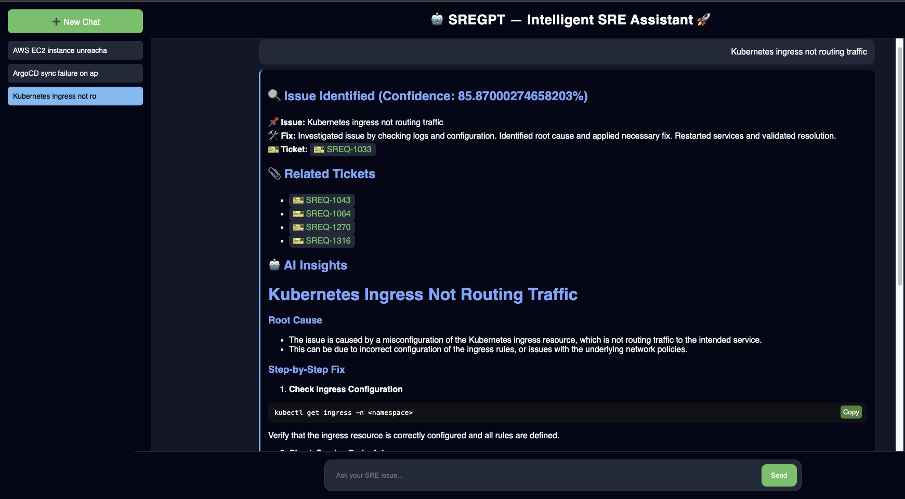

# SREGPT

SREGPT is a local retrieval-augmented troubleshooting assistant for SRE and DevOps incidents. It uses FastAPI for the API layer, FAISS for similarity search over past incident records, SentenceTransformers for embeddings, and Ollama with `llama3` for local answer generation.

## Preview



## Architecture

```text
           ┌──────────────┐
           │   User (UI)  │
           └──────┬───────┘
                  ↓
           ┌──────────────┐
           │   FastAPI    │  ← Entry point
           └──────┬───────┘
                  ↓
   ┌────────────────────────────┐
   │  Query Processing Layer    │
   └──────┬─────────────────────┘
          ↓
   ┌────────────────────────────┐
   │  Embedding Model           │
   │ (SentenceTransformer)      │
   └──────┬─────────────────────┘
          ↓
   ┌────────────────────────────┐
   │  Vector Search (FAISS)     │
   └──────┬─────────────────────┘
          ↓
   ┌────────────────────────────┐
   │  Incident Data Layer       │
   │ (CSV → Pandas → records)   │
   └──────┬─────────────────────┘
          ↓
   ┌────────────────────────────┐
   │  Decision Engine           │
   │ (Threshold Logic)          │
   └──────┬─────────────┬───────┘
          ↓             ↓
 High Match ✅      Low Match ❌
     ↓                  ↓
┌──────────────┐  ┌────────────────┐
│ Return KB    │  │  Ollama LLM    │
│ Solution     │  │ (llama3)       │
│ + Ticket     │  └──────┬─────────┘
└──────┬───────┘         ↓
       └──────────→ Final Response
```

Runtime flow:

1. The user asks a troubleshooting question from the browser UI.
2. FastAPI receives the request and passes it into the query-processing flow.
3. The query is embedded with `all-MiniLM-L6-v2` using SentenceTransformers.
4. FAISS searches the internal incident vectors built from the CSV knowledge base.
5. The decision layer evaluates the best match score against the confidence threshold.
6. For a strong internal match, the app returns the matched solution and ticket context.
7. For a weak match, the app calls Ollama with `llama3` to generate a broader troubleshooting response.

## Tech Stack

- Python 3.9+
- FastAPI
- Uvicorn
- FAISS
- SentenceTransformers
- Pandas
- Ollama
- Llama 3
- HTML/CSS/JavaScript frontend

## Project Structure

```text
sregpt/
├── app.py                # FastAPI app and streaming endpoint
├── embeddings.py         # Builds FAISS index from CSV incident data
├── index.html            # Frontend chat UI
├── requirements.txt      # Python dependencies
├── data/
│   ├── issues.csv        # Source incident dataset
│   ├── index.faiss       # Generated FAISS index
│   └── data.pkl          # Normalized incident records
└── .venv/                # Local virtual environment (ignored by git)
```

## Prerequisites

Make sure these are available on your machine:

- Python 3.9 or later
- `pip`
- Ollama installed locally
- The `llama3` model pulled in Ollama

## Setup

Create and activate a virtual environment:

```sh
python3 -m venv .venv
source .venv/bin/activate
```

Install dependencies:

```sh
pip install -r requirements.txt
```

## Prepare the Knowledge Base

The retrieval layer uses [`data/issues.csv`](/Users/sackashyap/Documents/mytech/sregpt/data/issues.csv) as the source dataset.

To build or rebuild the FAISS index:

```sh
python embeddings.py
```

This generates:

- [`data/index.faiss`](/Users/sackashyap/Documents/mytech/sregpt/data/index.faiss)
- [`data/data.pkl`](/Users/sackashyap/Documents/mytech/sregpt/data/data.pkl)

Expected CSV columns:

- `Issue Subject`
- `Issue Solution`
- `Ticket ID`

## Start Ollama

In a separate terminal, start the Ollama server:

```sh
ollama serve
```

If the model is not available yet, pull it first:

```sh
ollama pull llama3
```

You can test the model with:

```sh
ollama run llama3
```

## Run the API

Start the FastAPI server:

```sh
uvicorn app:app --reload
```

The API will run at:

```text
http://127.0.0.1:8000
```

Health check:

```sh
curl http://127.0.0.1:8000/
```

Example query:

```sh
curl "http://127.0.0.1:8000/ask-stream?query=node%20not%20ready"
```

## Frontend

The browser UI is in [`index.html`](/Users/sackashyap/Documents/mytech/sregpt/index.html).

Open it directly in a browser, or serve the folder locally with any static file server. The page calls the FastAPI endpoint:

```text
GET /ask-stream?query=...
```

The UI supports:

- chat-style interaction
- markdown rendering
- syntax-highlighted code blocks
- local chat persistence in browser storage
- clearing chat history

## API Endpoints

### `GET /`

Simple health endpoint.

Example response:

```json
{
  "message": "SREGPT running 🚀"
}
```

### `GET /ask-stream?query=...`

Streams a troubleshooting response built from:

- top FAISS matches from the internal ticket dataset
- Llama 3 generation through Ollama

## How Retrieval Works

[`embeddings.py`](/Users/sackashyap/Documents/mytech/sregpt/embeddings.py) normalizes the CSV columns into this internal schema:

- `issue`
- `solution`
- `ticket`

[`app.py`](/Users/sackashyap/Documents/mytech/sregpt/app.py) then:

1. embeds the user query
2. searches the FAISS index
3. ranks the nearest records
4. builds a markdown response scaffold
5. streams the final grounded answer from Ollama

## Common Commands

Activate virtual environment:

```sh
source .venv/bin/activate
```

Check installed package:

```sh
pip show fastapi
```

Rebuild embeddings:

```sh
python embeddings.py
```

Run app:

```sh
uvicorn app:app --reload
```

## Troubleshooting

### `could not connect to ollama server`

Start Ollama:

```sh
ollama serve
```

### `could not open data/index.faiss`

Build the index:

```sh
python embeddings.py
```

### `500 Internal Server Error` from `/ask-stream`

Check:

- Ollama is running
- `llama3` is available locally
- `data/issues.csv` exists
- `data/index.faiss` and `data/data.pkl` were built from the current CSV

## Git Ignore

This repo ignores the local virtual environment through [`.gitignore`](/Users/sackashyap/Documents/mytech/sregpt/.gitignore):

```gitignore
.venv/
```

## Notes

- This project is designed for local enterprise-style troubleshooting workflows.
- It currently uses local Ollama inference instead of a cloud LLM API.
- The incident knowledge base is file-based and suitable for a small internal dataset. For production-scale usage, move ticket data and vector storage into managed services with explicit versioning and ingestion pipelines.
